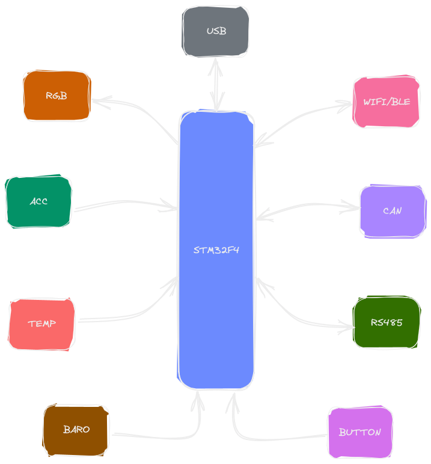

# **d3vkit board**
This repository contains information and resources related to a custom board featuring the STM32F412RET6 microcontroller. This board has been developed for study purposes and includes several integrated components, such as the LSM6DSMTR sensor (accelerometer and gyroscope), the HDC1080DMBR sensor (temperature and humidity), and the LPS22HBTR sensor (barometer). Additionally, the board features an SD card slot, CAN and RS485 interfaces, USB connectivity, and the ESP32-C3-WROOM-02-H4 module for Wi-Fi and Bluetooth communication.

  

# **overview**

The custom board has been designed to provide a flexible platform for studying and experimentation using the STM32F412RET6 microcontroller. It encompasses the following key features:

1. **STM32F412RET6 Microcontroller**: The STM32F412RET6 is a high-performance microcontroller based on the ARM Cortex-M4 architecture. It operates at a clock frequency of up to 100 MHz, with 512 KB of flash memory and 128 KB of RAM. This microcontroller offers advanced features, including peripheral interfaces, ADC, timers, and serial communication.

2. **LSM6DSMTR Sensor (Accelerometer and Gyroscope)**: The board integrates the LSM6DSMTR sensor, which combines a three-axis accelerometer and a three-axis gyroscope. This enables accurate motion detection, acceleration measurement, and inclination sensing.

3. **HDC1080DMBR Sensor (Temperature and Humidity)**: The board includes the HDC1080DMBR sensor, which provides precise temperature and humidity measurements in the surrounding environment. This feature is beneficial for projects involving climate monitoring or environmental control.

4. **LPS22HBTR Sensor (Barometer)**: The board incorporates the LPS22HBTR sensor, allowing atmospheric pressure measurements. This functionality proves useful for projects related to weather monitoring, altitude sensing, or flight control.

5. **SD Card Slot**: The board features an SD card slot, enabling read and write operations with removable memory cards. This facilitates data storage, such as measurement logs or configuration files.

6. **CAN and RS485 Interfaces**: The board incorporates circuits for CAN and RS485 interfaces, widely used in industrial applications for device communication. These interfaces ease integration within automation systems.

7. **USB Connectivity**: The board provides a USB port for communication with a computer or connection to other USB devices. This port supports data transfer and can power the board.

8. **ESP32-C3-WROOM-02-H4 Module (Wi-Fi and Bluetooth)**: The board includes the ESP32-C3-WROOM-02-H4 module, offering Wi-Fi and Bluetooth connectivity. This enables wireless communication, connection to Wi-Fi networks, and interaction with Bluetooth devices, making it suitable for IoT projects.

# **contact**

If you have any questions or need further information, feel free to get in touch. You can reach me via the provided email address in the repository's profile.

# bill of material

you can see the entire bill of materials through this link [d3vk1t-bom](https://gustavoadono.github.io/board/d3vk1t-bom).